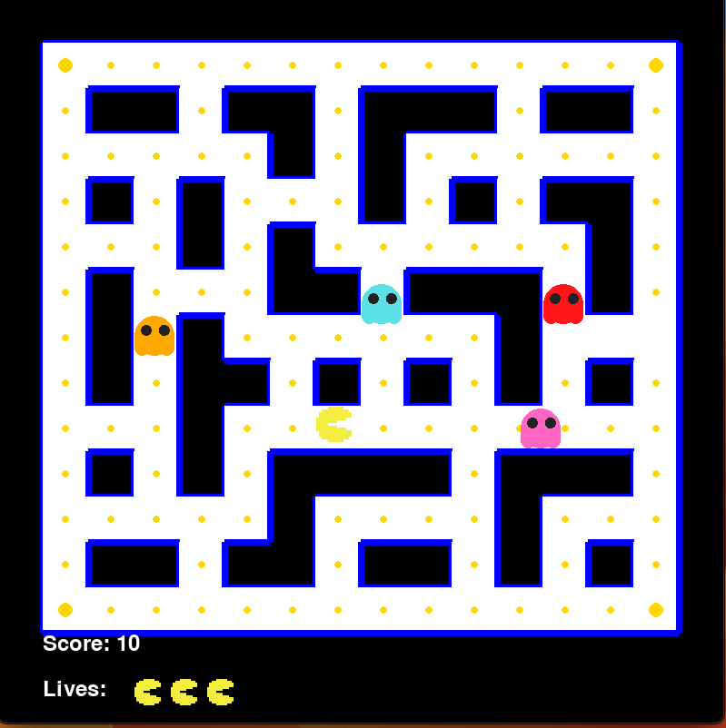
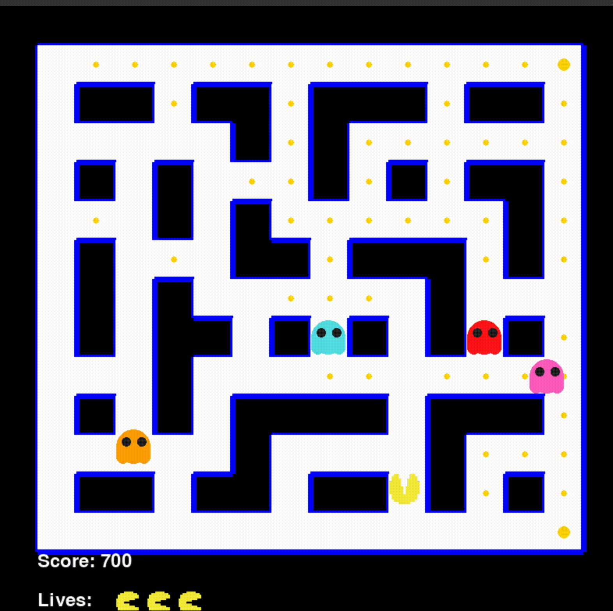
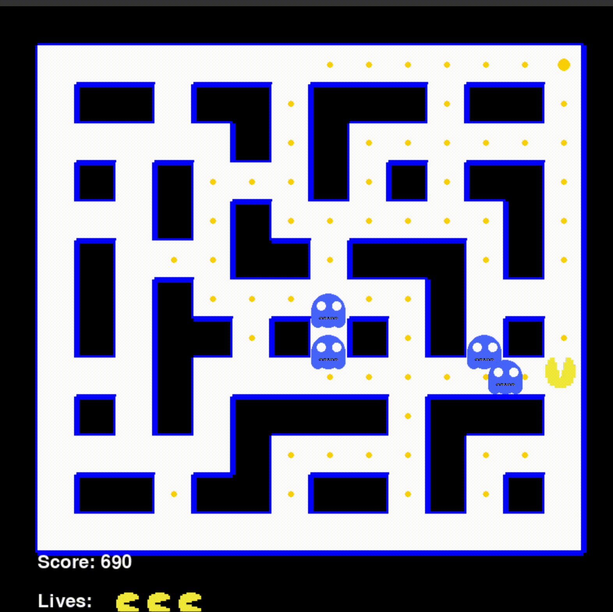
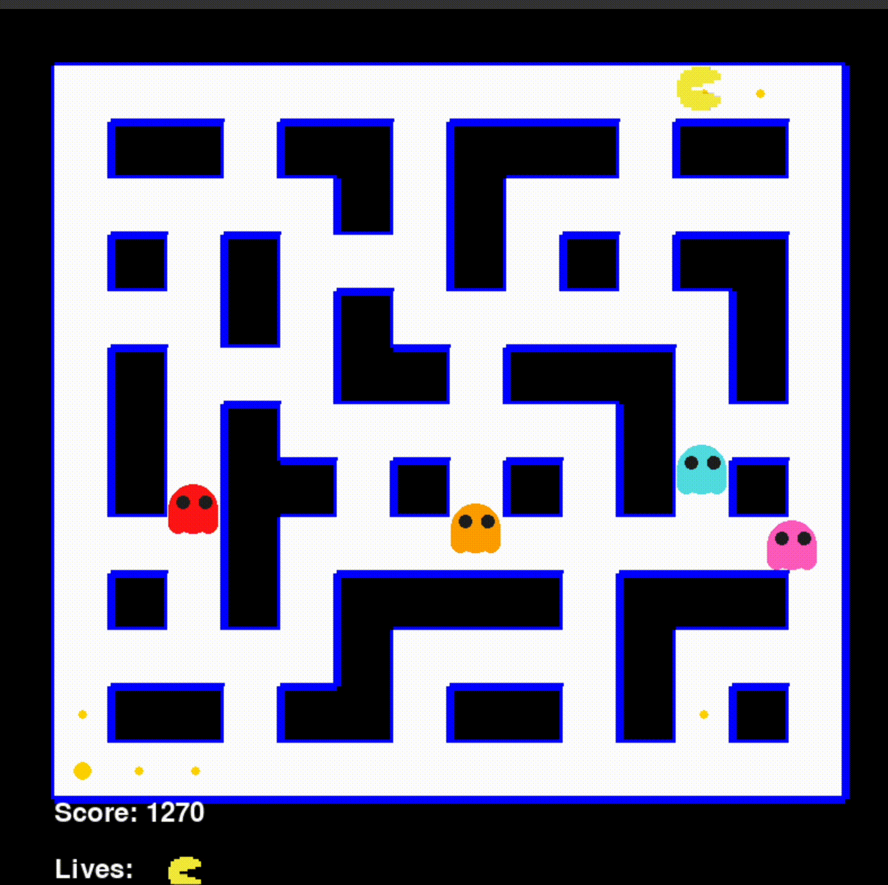

# Projet Pac-Man en Python

### Requirements
`python3 -m pip install -U pygame --user`

## Introduction

Pac-Man est un jeu vidéo d'arcade classique où le joueur contrôle Pac-Man, un personnage qui se déplace dans un labyrinthe pour manger des pastilles tout en évitant les fantômes. Dans ce projet, nous allons réaliser une version simplifiée de Pac-Man en utilisant le langage Python et la bibliothèque Pygame. Le jeu sera contrôlé à l'aide des flèches du clavier pour déplacer Pac-Man dans le labyrinthe.

Pour une version plus complète de Pac-Man, vous pouvez consulter [ce lien](https://freepacman.org/).

## Structure du Projet

Pour organiser notre code de manière claire et modulaire, nous avons structuré le projet de la manière suivante :

```plaintext
pacman/
├── main.py
├── game.py
├── pacman.py
├── ghost.py
├── helper.py
├── home.py
├── end.py
├── config.py
└── assets/
    └── images/
```

#### Détails des fichiers :

- **main.py**  
  Le fichier principal qui lance le jeu. Il contient le point d'entrée du programme et initialise les différentes parties du jeu, y compris la gestion des événements et l'affichage. C'est ce fichier qui doit être exécuté pour démarrer le jeu, à l'aide de la commande suivante : ```python main.py``` ou directement dans votre IDE.

- **game.py**  
  Gère la logique principale du jeu, y compris le contrôle des niveaux, des mouvements des personnages (Pac-Man et les fantômes), et la progression générale du jeu. Il orchestre le déroulement du jeu.

- **pacman.py**  
  Définit le comportement du Pac-Man.

- **ghost.py**  
  Gère le comportement des fantômes ennemis.

- **helper.py**  
  Fournit des fonctions utilitaires et du code réutilisable pour le projet.

- **home.py**  
  Ce fichier gère l’affichage de l’écran d’accueil où le joueur peut démarrer le jeu. Il permet ainsi au joueur de débuter la partie.

- **end.py**  
  Gère l’écran de fin de partie. Ce fichier affiche le résultat de la partie (victoire ou défaite) avec une image de fond et un message en français au centre de l’écran.

- **config.py**  
  Contient les paramètres de configuration du jeu, comme la taille de l'écran, la vitesse des personnages, et d'autres constantes utilisées pour ajuster le gameplay.

- **assets/images/**  
  Ce dossier contient les ressources graphiques du jeu, telles que les images des personnages, des éléments de décor, et les icônes.

### Travail à réaliser

#### Partie 1 : variables et structures de contrôle

Dans le fichier `helper.py`, vous devez compléter les trois fonctions suivantes afin de créer la base du jeu Pac-Man. Les instructions détaillées se trouvent dans le fichier.

1. **`create_board()`** : Cette fonction doit générer le labyrinthe du jeu sous forme d'une matrice 2D où `1` représente un mur et `0` représente un chemin que Pac-Man peut emprunter. Le labyrinthe doit inclure des zones complexes, des passages étroits et des chemins ouverts. Vous devrez adapter le modèle fourni pour créer une structure de labyrinthe fonctionnelle qui se ressemble à l'image ci-dessous (remplacer les 1 par des 0 aux bons endroits).

2. **`create_coins(board)`** : Cette fonction doit placer des pièces dans le labyrinthe sur toutes les positions où il y a un chemin (`0`). Assurez-vous de retirer les pièces des coins (positions spéciales) ainsi que du centre du labyrinthe, comme spécifié par le jeu classique.

3. **`create_special_coins(board)`** : Cette fonction doit placer des pièces spéciales (plus grandes ou avec un effet spécial) à des positions spécifiques du labyrinthe. Ces positions vous sont données dans le code sous la forme de coordonnées (par exemple, `special_coins_pos`).

Votre tâche est donc d'implémenter ces fonctions pour générer le labyrinthe et les pièces du jeu. Ces éléments constituent la base sur laquelle Pac-Man évoluera dans le jeu. La vue du labyrinthe généré doit ressembler à l'image ci-dessous. Assurez-vous également que les deux dernières lignes du tableau (dans la liste `maze`) restent entièrement composées de valeurs `1`, représentant les murs du labyrinthe.










#### Partie 2 : 

1. **`handle_keypress()`** : Dans le fichier `game.py`, vous devez implémenter la logique qui gère les mouvements de Pac-Man en fonction des touches de direction appuyées par le joueur.
2. **`move()`** : Dans le fichier `pacman.py`, vous devez implémenter le système de déplacement de Pac-Man.
3. **`move()`** : Dans le fichier `ghost.py`, vous devez compléter le déplacement des fantômes. Vous devrez gérer leurs mouvements automatiques, vérifier les collisions avec les murs, et changer de direction si nécessaire
4. **`change_direction()`** : Dans le fichier `ghost.py`, vous devez implémenter la fonction qui permet au fantôme de changer de direction lorsqu'il rencontre un obstacle.

#### Partie 3 : 

1. **`check_collision()`** : Dans le fichier `game.py`, vous devez implémenter la fonction qui vérifie si Pac-Man peut se déplacer dans une direction sans entrer en collision avec un mur.
2. **`check_score()`** : Dans le fichier `game.py`, vous devez implémenter la fonction qui gère la collecte des pièces par Pac-Man et met à jour le score.
3. **`check_special_coins()`** : Dans le fichier `game.py`, vous devez implémenter la fonction qui gère la collecte des pièces spéciales par Pac-Man et met à jour le score.

### Ressources

Pour vous aider à implémenter les fonctionnalités du projet et à comprendre les outils que nous utilisons, voici des ressources utiles :

- [Documentation Python sur les listes : `append()` et `remove()`](https://docs.python.org/3/tutorial/datastructures.html#more-on-lists)
- [Comprendre `self` dans les classes Python](https://www.geeksforgeeks.org/self-in-python-class/)
- [Documentation de Pygame](https://www.pygame.org/docs/)

### Remise

La remise du projet doit se faire en déposant une archive `.zip` contenant l'intégralité du code source sur la plateforme Moodle.

- **Date limite de remise** : 6 octobre 2024 à 23h59.
- **Pénalités pour retard** : Chaque jour de retard entraînera une pénalité de 15 % sur la note finale.

Assurez-vous que votre archive `.zip` est bien organisée et qu'elle inclut tous les fichiers nécessaires au bon fonctionnement du projet.

### Barème

| **Partie**                                | **Tâche**                                                                 | **Points** |
|-------------------------------------------|---------------------------------------------------------------------------|------------|
| **Partie 1 : Variables et structures de contrôle** |                                                                           | **/7**     |
|                                           | 1. Compléter la fonction `create_board()` pour générer un labyrinthe fonctionnel.| 4          |
|                                           | 2. Implémenter `create_coins(board)` pour placer correctement les pièces dans le labyrinthe.| 2          |
|                                           | 3. Implémenter `create_special_coins(board)` pour placer les pièces spéciales aux positions spécifiées.| 1          |
| **Partie 2 : Logique des mouvements et interactions** |                                                                           | **/7**     |
|                                           | 1. Implémenter `handle_keypress()` pour gérer les mouvements de Pac-Man en fonction des touches pressées.| 2          |
|                                           | 2. Compléter la fonction `move()` dans `pacman.py` pour gérer le déplacement de Pac-Man.| 2          |
|                                           | 3. Compléter la fonction `move()` dans `ghost.py` pour gérer les mouvements des fantômes.| 2          |
|                                           | 4. Implémenter `change_direction()` dans `ghost.py` pour changer la direction des fantômes quand nécessaire.| 1          |
| **Partie 3 : Gestion des collisions et du score**  |                                                                           | **/6**     |
|                                           | 1. Implémenter `check_collision()` pour vérifier si Pac-Man peut se déplacer sans entrer en collision.| 3          |
|                                           | 2. Implémenter `check_score()` pour gérer la collecte des pièces et mettre à jour le score.| 2          |
|                                           | 3. Implémenter `check_special_coins()` pour gérer la collecte des pièces spéciales.| 1          |
| **Total**                                 |                                                                           | **/20**    |

